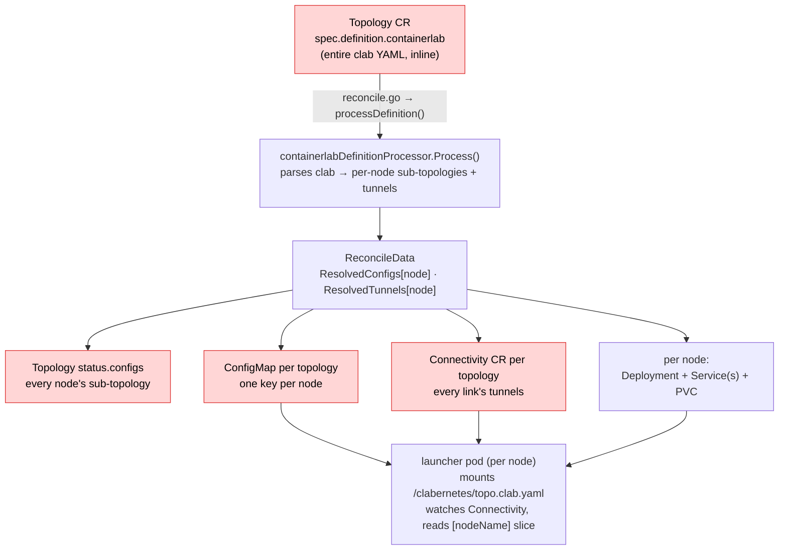
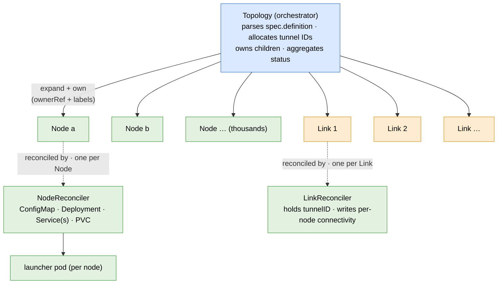

# Design 0001 — Scaling clabernetes with `Node` and `Link` custom resources

| | |
|---|---|
| **Status** | Draft / proposal — Phase 0 done (inert); Phase 1 & 2 implemented (gated `spec.deployment.decompose`: per-node Node + ConfigMap + Connectivity + Link ledger); Phase 3 implemented (additive `spec.definition.containerlabRef` ConfigMap/URL); builds & tests pass |
| **Scope** | `clabernetes` only — **no changes** to `containerlab` or `clab-api-server` |
| **Goal** | Remove the single-object size ceiling so a `Topology` can describe **thousands** of nodes |
| **Supersedes** | The earlier `containerlabRef` / `nodeConfigRefs` ConfigMap experiment (never merged) |

> This is a working design, not a final API. The Kubernetes-native decomposition into
> per-`Node` / per-`Link` objects is the direction the maintainers have indicated is the
> "correct" long-term shape. **The exact CRD field layout must be ratified with the maintainers
> before the controller behaviour in Phase 1+ lands.** Phase 0 (the API types + the pure
> expansion function + tests) is deliberately inert: it adds types and logic but changes **no**
> runtime behaviour, so it is safe to land while the API is being discussed.

---

## 1. Why

The dream is concrete and worth stating plainly: describe a network of thousands of nodes as
plain Kubernetes objects, `kubectl apply`, and let the scheduler place emulated routers across a
cluster — no hand-rolled VXLAN meshes, no manual server wrangling. clabernetes already does this
for *small* topologies. It cannot do it for *large* ones, and the reason is not the data plane —
it is the **control plane object model**.

### 1.1 How a Topology flows today (grounded in the code)



> 🔴 Red boxes are the **four single objects whose size grows with the topology** — the scaling
> ceilings this design removes.

Each launcher pod mounts **its own** single-node sub-topology at `/clabernetes/topo.clab.yaml`
(`deployment.go:687`) and runs `/clabernetes/manager launch`. The launcher then **watches the
`Connectivity` CR** and pulls out only its own slice — `tunnelsCR.Spec.PointToPointTunnels[nodeName]`
(`launcher/connectivity/watch.go:53`) — to build VXLAN/slurpeeth tunnels to peer services.

The critical observation: **containerlab inside the launcher only ever sees one node.** The
"split the lab into pieces and wire them together" work is *entirely* a clabernetes controller
concern. That is why this whole effort is clabernetes-only.

### 1.2 The ceiling

etcd caps a single object at ~1.5 MB (`ConfigMap` data is effectively ~1 MB; the code already
references this — see the `FilesFromURL` doc comment in `topologyspec.go`). Today **four objects
grow with the size of the topology**, and each is a *single* object:

| # | Object | Field | Grows with |
|---|--------|-------|-----------|
| 1 | `Topology` | `spec.definition.containerlab` (raw input) | whole topology |
| 2 | `Topology` | `status.configs` (every node's sub-topology) | number of nodes |
| 3 | `ConfigMap "<topology>"` | one key per node | number of nodes |
| 4 | `Connectivity "<topology>"` | `spec.pointToPointTunnels` (every link) | number of links |

Plus one *algorithm* that needs a **global view**: `AllocateTunnelIDs` (`tunnels.go`) iterates
over **all** processed tunnels in a single reconcile and linearly scans `1 … 16_000_000` for free
VNIs. It cannot run if it cannot see every link at once.

Rough math: a single SR Linux node sub-topology serialises to ~1–3 KB of YAML. At ~2 KB/node the
per-topology `ConfigMap` and `status.configs` each saturate ~1 MB at **~400–500 nodes** — and that
is the ceiling regardless of how big the cluster is. The data plane (one Deployment per node) would
happily scale to thousands; the *object model* is what stops us.

---

## 2. Goals / non-goals

**Goals**

- Remove the four single-object ceilings: per-node and per-link state live in their own objects.
- Preserve **exactly** today's behaviour for existing inline topologies (no silent breakage).
- Keep tunnel-ID allocation semantics identical (allocate-once, never renumber a live link).
- Stay upstreamable: idiomatic CRDs, codegen, owner refs, RBAC, tests.
- **Zero** changes to `containerlab` or `clab-api-server`.

**Non-goals (for this effort)**

- Changing the data plane. Tunnels stay VXLAN / slurpeeth.
- Changing the launcher runtime model (still one launcher Deployment per node/group).
- Re-architecting the KNE path. KNE reaches parity in a later phase by reusing the same expansion
  seam.

---

## 3. Target architecture

Introduce two CRDs in the existing group `clabernetes.containerlab.dev/v1alpha1`:

- **`Node`** — one object per containerlab node (or node *group*, see §3.3). Holds that node's
  single-node sub-topology plus the per-node knobs (resources, expose, persistence, probes, image
  pull, files-from-ConfigMap/URL). This is the per-node *slice* of what `Topology` carries today.
- **`Link`** — one object per containerlab link. Holds the two endpoints, the connectivity flavour,
  and the **allocated tunnel ID**.

`Topology` stops being a monolith and becomes an **orchestrator**: it parses the definition, expands
it into the desired set of `Node` and `Link` objects, owns them (via `ownerReferences` for cascade
delete), allocates tunnel IDs, and **aggregates** their status back up. Each `Node` / `Link` then has
its own reconciler doing the bounded, per-object work.



> No single object grows with the topology: each `Node` and each `Link` is its own object with its
> own reconciler. Whole-topology reads become paginated, label-selected `List`s — never one giant
> object.

Why this removes the ceiling: there is **no single object** whose size grows with the topology.
The only remaining whole-topology object is the `Topology` itself, whose `spec.definition` (the raw
input) is addressed separately in §7. Reads become `List` calls (paginated, label-selected) instead
of one giant object — O(N) bytes total but never O(N) in *one* object.

### 3.1 `Node` (sketch — subject to maintainer ratification)

```go
type NodeSpec struct {
    TopologyName string `json:"topologyName"`   // owning Topology (also an ownerRef + label)
    NodeName     string `json:"nodeName"`       // containerlab node name
    Kind         string `json:"kind"`           // "containerlab" | "kne"

    // The single-node containerlab sub-topology YAML — bounded by node degree, not topo size.
    Definition string `json:"definition"`

    // Per-node knobs sliced out of today's Topology.spec:
    FilesFromConfigMap []FileFromConfigMap  `json:"filesFromConfigMap,omitempty"` // frr.conf, daemons, startup-config…
    FilesFromURL       []FileFromURL        `json:"filesFromURL,omitempty"`       // files larger than ~1MB
    Expose       NodeExpose                 `json:"expose,omitempty"`
    Deployment   NodeDeploymentOverrides    `json:"deployment,omitempty"` // resources, scheduling, image…
    Persistence  Persistence                `json:"persistence,omitempty"`
    StatusProbes StatusProbes               `json:"statusProbes,omitempty"`
    ImagePull    ImagePull                  `json:"imagePull,omitempty"`
    Connectivity string                     `json:"connectivity,omitempty"` // vxlan | slurpeeth
}

type NodeStatus struct {
    Ready        bool                 `json:"ready"`
    Readiness    string               `json:"readiness"`            // ready|notready|unknown
    ProbeStatuses NodeProbeStatuses   `json:"probeStatuses,omitempty"`
    ExposedPorts *ExposedPorts        `json:"exposedPorts,omitempty"`
    ReconcileHash string              `json:"reconcileHash,omitempty"`
}
```

> **Phase 0 implements a lean subset** of this target `NodeSpec` — `TopologyName`, `NodeName`,
> `Kind`, `Definition`, `Connectivity`, `FilesFromConfigMap`, `FilesFromURL`. The remaining per-node
> knobs (`Expose`, deployment overrides, `Persistence`, `StatusProbes`, `ImagePull`) and the richer
> status land in Phase 1, when the `NodeReconciler` actually consumes them.

### 3.2 `Link` (sketch)

```go
type LinkSpec struct {
    TopologyName string       `json:"topologyName"`
    EndpointA    LinkEndpoint `json:"endpointA"`     // {nodeName, interfaceName}
    EndpointB    LinkEndpoint `json:"endpointB"`     // {nodeName, interfaceName}; nodeName may be "host"
    Connectivity string       `json:"connectivity"`  // vxlan | slurpeeth
    // TunnelID is assigned ONCE by the Topology orchestrator and never renumbered while the
    // Link exists. 0 means "not yet allocated".
    TunnelID int `json:"tunnelID"`
}

type LinkStatus struct {
    Ready bool `json:"ready"`
}
```

A `Link` is the *symmetric* representation of what is today two half-tunnels in
`Connectivity.spec.pointToPointTunnels` (one entry under each node). Deriving the per-node
`PointToPointTunnel` slices from a `Link` is mechanical (see §6).

### 3.3 Node groups

The current processor already collapses `network-mode: container:<primary>` groups (e.g. Nokia
SR-SIM) into a single sub-topology deployed in one pod (`definitioncontainerlab.go:buildNodeGroups`).
A `Node` object therefore maps to a **node group**, not necessarily a single clab node: its
`definition` may contain the primary plus its secondaries, exactly as `ResolvedConfigs[primary]`
does today. Links *internal* to a group stay inside the group's `Node.definition`; only
cross-group links become `Link` objects. This preserves current semantics precisely.

---

## 4. The hard part: tunnel-ID allocation without a global object

This is the only genuinely tricky piece, so it gets its own section.

**Today:** `AllocateTunnelIDs` sees every tunnel in one reconcile, reuses any previously assigned
ID (matched by `localInterface`/`remoteInterface`/`remoteNode`), and assigns the lowest free ID to
the rest. Both half-tunnels of a link must end up with the **same** VNI.

**Constraint after decomposition:** there is no single object holding all links. We must keep:
(a) both ends of a link on the same ID, (b) IDs stable for the life of a link (renumbering a live
link tears down a working tunnel), and (c) allocation cheap.

**Options considered**

- **(A) Deterministic hash** `vni = H(sorted(endpointA, endpointB)) mod range`. No central state and
  both ends compute the same value — but collisions between *different* links need a tie-break that
  requires knowing the other links, i.e. a global view sneaks back in. Rejected as the primary
  mechanism.
- **(B) Centralised high-water-mark allocator on the `Topology` orchestrator (recommended).** The
  orchestrator owns a small counter (and the set of in-use IDs, recoverable by `List`-ing the
  `Link`s it owns and reading `spec.tunnelID`). When it expands the topology it assigns each *new*
  `Link` the next free ID and **bakes it into `Link.spec.tunnelID` at creation**. Existing `Link`s
  keep their IDs (idempotent — same allocate-once semantics as today). The "global view" shrinks
  from *all tunnel bytes in one object* to *one integer plus a label-selected List of small Link
  objects* — and the List is paginated, never a single oversized object.
- **(C) Allocate at expansion time by sorted index.** Simple and deterministic but renumbers on
  add/remove. Rejected for the renumber hazard.

**Decision:** Option **B**. It reproduces today's semantics exactly (allocate-once, reuse-on-match,
both ends share an ID because the *Link* — not the half-tunnel — owns the single ID) while making
the *payload* distributed. The orchestrator is the single writer of IDs, which sidesteps races.

---

## 5. Reconcile responsibilities

**Topology (orchestrator)** — `controllers/topology`:
1. Parse `spec.definition` → desired `Node` set + `Link` set (the **pure expansion function**,
   Phase 0, reusing `containerlabDefinitionProcessor`).
2. Allocate `tunnelID` for any new `Link` (high-water-mark, §4).
3. Reconcile desired vs. actual `Node`/`Link` objects (create / update / prune by ownerRef+label).
4. Aggregate `Node`/`Link` status into `Topology.status` (ready counts, state, per-node readiness).

**NodeReconciler** — new `controllers/node`: render this node's `ConfigMap` (sub-topology +
files-from-url), `Deployment`, `Service(s)`, `PVC`; report readiness. This is today's
`deployment.go` / `service*.go` / `configmap.go` / `pvc.go` logic, re-homed to operate on **one**
`Node` instead of looping over a whole topology.

**LinkReconciler** — new `controllers/link`: for the two nodes the link touches, ensure the
per-node connectivity reflects `spec.tunnelID`. Connectivity regroups **per node** (each node only
needs the tunnels that touch it — bounded by node degree, not topology size). The launcher already
keys by node name (`watch.go:53`), so it changes from "watch the one big Connectivity, read my key"
to "watch my own node's connectivity object" — a small, mechanical launcher change.

---

## 6. Backward compatibility & migration

- **Inline `spec.definition.containerlab` stays a first-class, fully-supported input.** Expansion is
  an *internal* mechanism; users keep writing the same `Topology` they write today.
- **Phased, gated rollout.** Phase 1+ controller behaviour sits behind a feature gate / opt-in field
  (working name `spec.deployment.decompose` or a global config flag). Default stays the current
  in-Topology behaviour until the decomposed path has soaked. This guarantees existing clusters are
  untouched.
- The legacy `Connectivity` CR remains during the transition; it is deprecated in favour of per-node
  connectivity once the launcher watch is migrated.
- No data migration is required for existing `Topology` objects — they simply continue on the legacy
  path until an operator opts a topology into decomposition.

---

## 7. The one remaining big object: the raw input

After §3, the only whole-topology object left is `Topology.spec.definition` (the raw clab YAML the
user submits). For a thousand-node lab this single string can itself exceed 1 MB. This is the *one*
place the earlier `containerlabRef` idea was pointing in the right direction — but it should be
scoped to **only the raw input**, since `Node`/`Link` now carry everything downstream:

- Allow the definition to be sourced indirectly — `spec.definition.containerlabRef` (a `ConfigMap`)
  or reuse the existing `FileFromURL` mechanism for the topology file itself. The orchestrator reads
  it once, expands, and never stores it whole again.
- `clabverter` (which converts a clab project into clabernetes manifests) gains a mode that, for very
  large inputs, emits the definition as a `ConfigMap`/URL reference instead of inline.

This is deferred to a later phase; it is independent of the `Node`/`Link` work and only matters past
~500 nodes.

---

## 8. Codegen, RBAC, testing

- **Codegen (run):** the new types carry `+kubebuilder`/`+k8s:deepcopy-gen` markers and have been put
  through `make run-generate`, producing the deepcopy (`zz_generated.deepcopy.go`), the CRD YAMLs
  (`assets/crd/…_nodes.yaml`, `…_links.yaml` plus the chart copies under `charts/clabernetes/crds/`),
  the typed clientset (`generated/clientset/…/node.go`, `link.go` + fakes), and the openapi schemas.
  Caveat: `make run-generate` installs generators with `@latest`, so it also bumped `controller-gen`
  (v0.20.0 → v0.21.0) and reflowed some pre-existing files; pin the generator versions if a minimal,
  reviewer-friendly diff is wanted for the upstream PR.
- **RBAC:** the manager `Role`/`ClusterRole` in `charts/clabernetes` gains `nodes`/`links` verbs; the
  launcher's connectivity watch RBAC narrows to its own node's object.
- **Testing:**
  - *Phase 0:* table-driven unit tests for the expansion function — assert the `Node`/`Link` set and
    allocated IDs for representative topologies (standalone, host links, SR-SIM groups, multi-link).
    Golden files mirror the existing `controllers/topology/test-fixtures/golden` convention.
  - *Phase 1+:* `envtest` for the new reconcilers; an e2e at a few hundred nodes proving the object
    model holds where the monolith would have failed.

---

## 9. Phasing (each phase independently shippable)

| Phase | Deliverable | Runtime impact |
|------:|-------------|----------------|
| **0** | This doc + `Node`/`Link` API types + scheme registration + **generated** deepcopy/CRDs/clientset/openapi + **pure expansion function** `Topology → ([]Node, []Link)` with unit tests | **None** — inert types & a pure function |
| 1 | `NodeReconciler` renders Deployment/Service/PVC/ConfigMap from a `Node`; Topology creates `Node`s (gated) | Gated/opt-in |
| 2 | `LinkReconciler` + per-node connectivity + high-water-mark allocation; migrate launcher watch; retire monolithic `Connectivity` | Gated/opt-in |
| 3 | Indirect `spec.definition` (ConfigMap/URL) for the raw input; `clabverter` support | Additive |
| 4 | Status aggregation polish, migration UX, docs, e2e at scale; flip default | Default flip |

**This change set delivers Phase 0.** It compiles, its tests pass, and it changes no runtime
behaviour — so it is safe to land (or to open as a proposal PR) while the API shape is ratified.

---

## 10. Risks & open questions

1. **API shape needs maintainer sign-off.** The field layouts in §3 are a starting point. This is
   "the correct way" only if the people who own the API agree on the way. Phase 0 is intentionally
   inert so this conversation can happen without blocking.
   - **Resource naming collision:** the `Node` kind's natural plural `nodes` overlaps with the core
     Kubernetes `Node` at the `kubectl` level (it is unambiguous to the API server via the group).
     Phase 0 ships a `clabnode` short name as a stopgap; the maintainers may prefer a distinct plural
     (e.g. `clabnodes`). `links` has no such core collision.
2. **Allocation semantics** (§4) — confirm high-water-mark over deterministic-hash. Recommended: B.
3. **Reconcile fan-out** — N `Node` reconciles per topology. Standard controller-runtime workqueue +
   owner index handles this; worth load-testing in Phase 1.
4. **Launcher connectivity migration** (§5) — small but touches the data plane; needs careful e2e.
5. **KNE parity** — the expansion seam is kind-agnostic, but the KNE processor must be taught to emit
   `Node`/`Link` too (later phase).

---

> **Phase progress & checklist** live in `0001-scale-progress.md` (plain-language log of what each
> phase changed and why, plus the tick-box "where are we" list).
